# MLOps Project: Design and Implement a Feature Store for Banking Analytics

## Table of Contents

1.  [Problem Statement](#problem-statement)
2.  [Approach & Concept](#approach--concept)
3.  [Data Source](#data-source)
4.  [Quickstart](#quickstart)
    *   [Docker Setup](#docker-setup)
    *   [Source Code](#source-code)
    *   [Instructions](#instructions)
5.  [Conclusion](#conclusion)
    *   [Images](#images)
    *   [Summary](#summary)
    *   [Future Expansion](#future-expansion)

## Problem Statement

The objective of this project is to build a robust Feature Store that processes and serves both historical and real-time banking transaction features. This Feature Store will:

1. Ingest transaction data through dual paths:
   - Batch processing of historical transaction records
   - Real-time streaming of new transactions via CDC (Change Data Capture)

2. Transform raw data into features for machine learning and serve features through a Feature Store:
   - Calculate time-window aggregations (e.g., weekly transaction metrics)
   - Offline store (MinIO) for model training
   - Online store (SQLite) for real-time inference
   - Unified feature retrieval API via Feast

The system will serve as a centralized platform for managing ML features derived from banking transaction data, ensuring consistency between training and serving environments while supporting both batch and real-time feature computation.

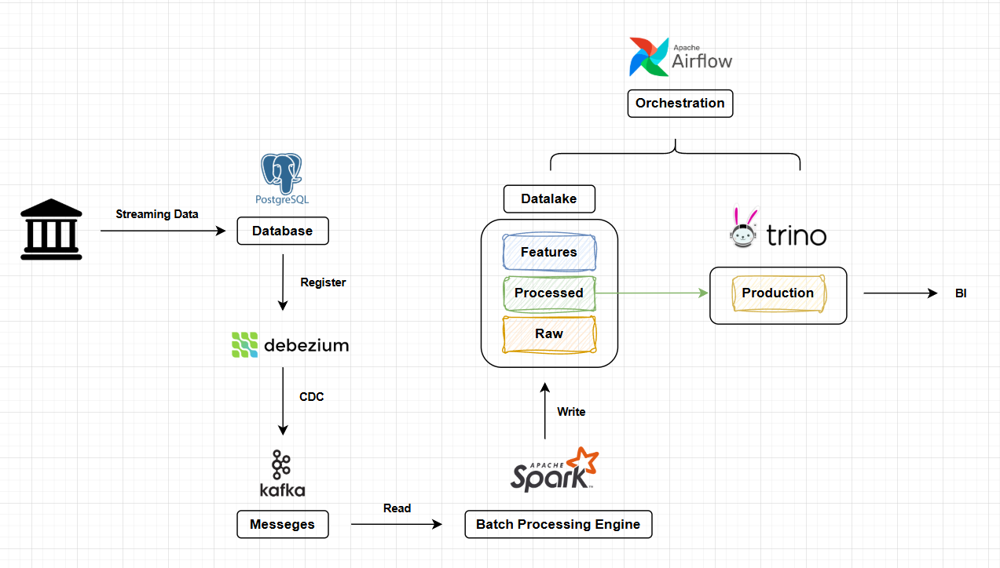

## Approach & Concept

The data processing flow consists of multiple layers:

*   **Source Layer:** PostgreSQL database storing transaction data
*   **CDC Layer (Debezium):** Captures data changes from PostgreSQL and publishes to Kafka topics
*   **Ingestion Layer:** 
    * Batch: Direct data generation to PostgreSQL
    * Streaming: Change data capture via Debezium-Kafka pipeline
*   **Processing Layer:**
    * Batch Processing: Spark jobs for feature engineering
    * Stream Processing: Real-time CDC event processing
*   **Storage Layer (MinIO):** 
    * Captures processed CDC events from Kafka
*   **Query Layer (Trino):** Allows querying the processed data across all layers
*   **Consumption Layer:** Supports analytics applications and ML services


## Data Source
*   Self Generated Data:
    ```shell
    schema = StructType([
            StructField("User ID", StringType(), True),
            StructField("Transaction ID", StringType(), True),
            StructField("Amount", DoubleType(), True),
            StructField("Vendor", StringType(), True),
            StructField("Sources", StringType(), True),
            StructField("Time", StringType(), True)
            ])
    ```
* Transaction Data: Generated daily via `step_1_gen_transaction_data.py` and stored in PostgreSQL
* Customer Data: Generated once via `step_0_gen_user_table.py` and stored in MinIO as Parquet format

## Quickstart

### Docker Setup

The project uses Docker and Docker Compose for easy deployment. Key files:

*   **`docker-compose.yaml`**: Defines the services (Airflow, Kafka, MinIO, Trino, etc.) and their configurations. Located at `docker_all/docker-airflow.yaml`

*   **`Dockerfile`**: Defines the build steps for the Airflow images, including installing dependencies. Located at `docker_all/Dockerfile`

### Source Code

The source code is organized into several directories:

*   **`dags/`**: Contains Airflow DAGs for orchestrating the data pipeline.
    *   `gen_data_daily.py`: DAG for generating daily transaction data and ingesting it into Kafka. Located at `docker_all/dags/gen_data_daily.py`
    *   `gen_lxw_fts.py`: DAG for calculating weekly features using Spark. Located at `docker_all/dags/gen_lxw_fts.py`
*   **`external_scripts/` or `scripts/`**: Contains Python scripts executed by Airflow tasks.
    *   `step_0_gen_user_table.py`: Generates customer demographic data and stores in MinIO as Parquet format
    *   `step_0_register_debezium.py`: Registers Debezium connector to capture PostgreSQL changes
    *   `step_1_1_gen_transaction_data.py`: Generates daily transaction data and stores in PostgreSQL. In Production, data can be generated through other sources
    *   `step_1_2_get_transaction_data.py`: Generates daily transaction data and stores in PostgreSQL. In Production, data can be generated through other sources
    *   `step_2_calculate_features.py`: Reads CDC events from Kafka, calculates user features using Spark, and stores results in MinIO
    *   `step_3_1_fs_register_table.py`: Register features and materialize features to a 
    *   `.env`: Contains environment variables for the scripts. Located at `/scripts/.env`
*   **`trino/`**: Contains configuration files for Trino.
    *   `catalog/lakehouse.properties`: Defines the connection to the Hive Metastore and MinIO for querying Delta Lake tables. Located at `docker_all/trino/catalog/lakehouse.properties`
*   **`tests/`**: Contains tests and log for testing

### Instructions
0.  **Prerequisites:**
    *   Docker and Docker Compose installed.
    *   Git (for cloning the repository).
    *   `Requirements.txt` for testing in a local machine
    *   File Bash: `setup_project.sh`
  
1.  **Edit config YAML:**

    *   YAML: `docker_all/docker-airflow.yaml`
        *   `/your/external/scripts:/opt/airflow/external_scripts`  # Add this line to help airflow can access external scripts
        *   `/your/external/output:/opt/airflow/results`  # Add this line to help airflow can access external folder
        *   `/your/external/feature_store:/opt/airflow/feature_store`  # Add this line to help airflow can access feature store folder
        *   Add build with context and target for airflow services => To reduce the time to build images. Only airflow-worker has pysaprk and other Python libraries
        *   Add mems to reduce resource consumption
        *   Add volumes for some services

2.  **Setup using `setup_project.sh`**:
    * Open the terminal and run `chmod +x setup_project.sh` to make the script executable
    * Open the terminal and run `bash ./setup_project.sh`
    * This bash script includes these components:

        *  **Repository Cloning:**

            ```shell
            git clone <repository_url>
            cd <repository_directory>
            ```

        *  **Create folders for airflow setup:**

            ```shell
            mkdir -p ./dags ./logs ./plugins ./scripts ./external_scripts ./results ./feature_store
            sudo chown -R "${AIRFLOW_UID}:${GROUP_ID}" ./dags ./logs ./plugins ./scripts ./external_scripts ./results ./feature_store
            sudo chmod -R 775 ./dags ./logs ./plugins ./scripts ./external_scripts ./results ./feature_store
            ```

        *   **Build image with a custom Dockerfile:**
        
            ```shell
            docker-compose -f docker-airflow.yaml build --no-cache
            docker-compose -f docker-airflow.yaml up -d
            ```

            *   Need to specify `airflow-base` and `airflow-worker` (build stages)
            *   `airflow-base`: This stage installs common dependencies like Java, build tools, and Python. It serves as a base for other stages.
            *   `airflow-worker`: This stage is based on `airflow-base` and installs worker-specific Python packages like `pyspark`, `pydeequ`, and other data-related libraries. => This stage is for Airflow worker nodes that execute tasks using these dependencies.

        * Setup Airflow user and password. Ensure the `AIRFLOW_UID` environment variable is set correctly to avoid permission issues. This is often set in the `.env` file or directly in the `docker-compose.yaml`.  The current value is located at `docker_all/AIRFLOW_UID`:
            ```shell
            if docker-compose exec airflow-webserver airflow users create \
                --username "${AIRFLOW_ADMIN_USER}" \
                --firstname "${AIRFLOW_ADMIN_FIRST}" \
                --lastname "${AIRFLOW_ADMIN_LAST}" \
                --role Admin \
                --email "${AIRFLOW_ADMIN_EMAIL}" \
                --password "${AIRFLOW_ADMIN_PASS}"; then
                echo "Airflow admin user created successfully."
            else
                echo "Error creating Airflow admin user."
                exit 1
            fi
            ```

3.  **Start the services:**

    ```shell
    docker-compose up -d
    ```

4.  **Access Airflow:**

    *   Open your web browser and navigate to `http://localhost:9091`.
    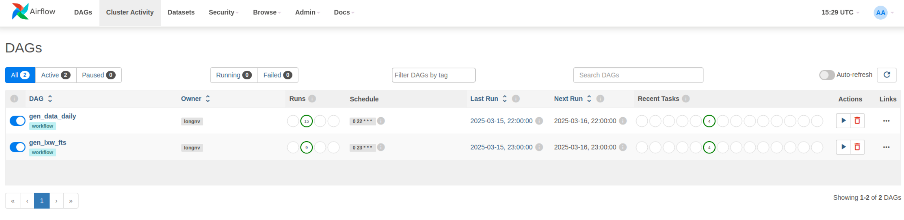

5. **Access Kafka UI:**

    *   Open your web browser and navigate to `http://localhost:8080`.
    
    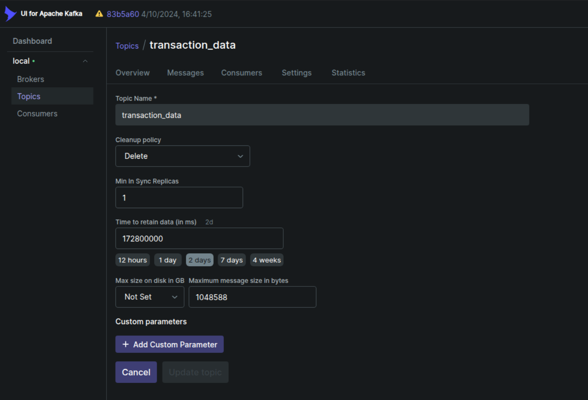

6. **Access PostgreSQL:**
    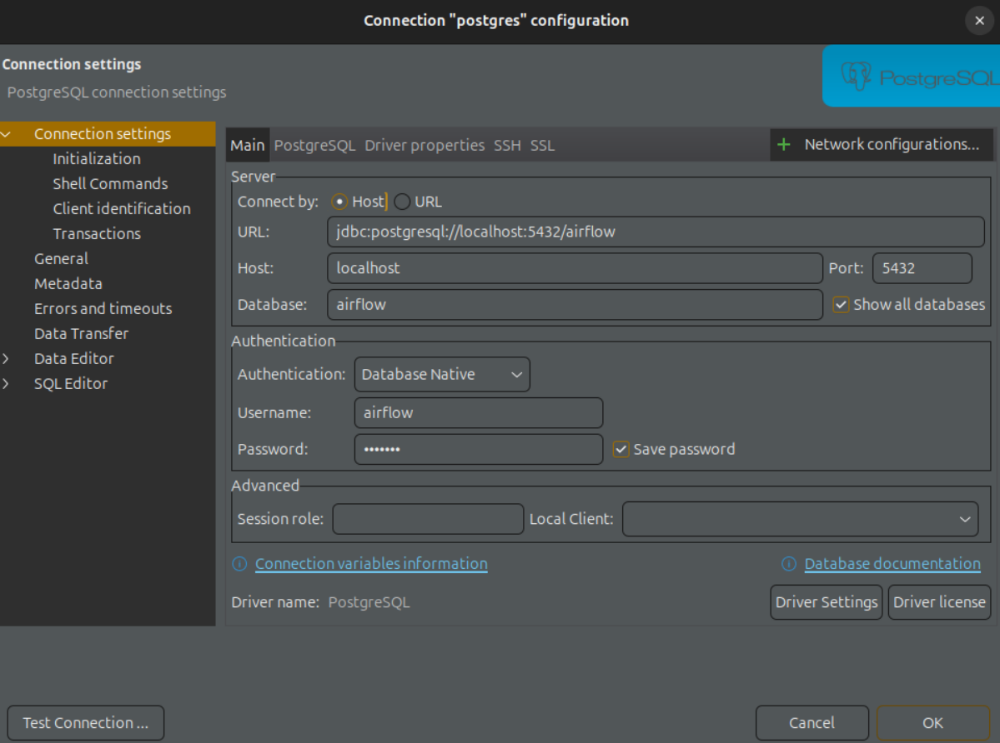

7. **Registers Debezium Connector**
    * Setup debezium config in `config/config_debezium.json`.
    * Run script `step_0_register_debezium.py` to register Debezium connector to capture changes in the data source and stores them in Kafka topics.
    * After running this script:
    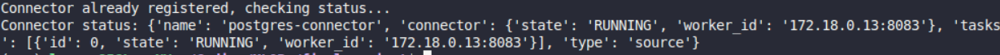

    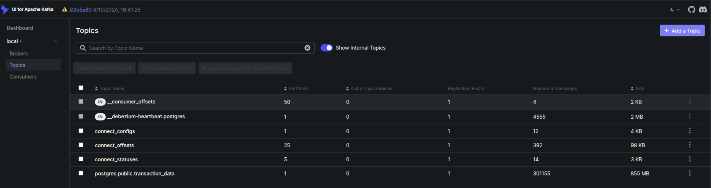

8. **Generates user table (optional)**
    * Run script `step_0_gen_user_table.py` to genetate user info and stores in MinIO bucket (`transaction-data-user`).
    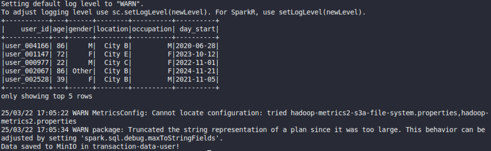

9. **Using Airflow to setup workflow**  
    * The pipeline consists of two main steps:
        1. Transaction data generation and ingestion
        2. Feature calculation and aggregation
    * There are 2 seperate dags: daily data and agg data (7 days):
        *  `gen_data_daily.py`
        *  `gen_lxw_fts.py`
    * Create pool `transaction_data` in Airflow UI (optional)
    * Materialize features and write to an online store

10. **Access MinIO:**
    * Open your web browser and navigate to `http://localhost:9010`.
    *   Use the credentials defined in the `.env` file (`S3_ACCESS_KEY` and `S3_SECRET_KEY`).
    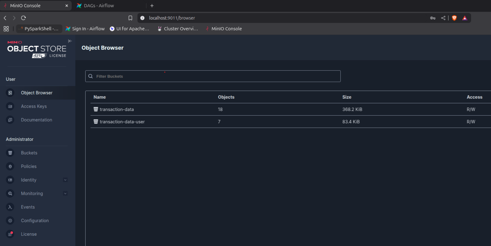

11. **Access Trino:**

    *   Open your web browser and navigate to `http://localhost:8081`.
    * Using Trino to connect to MinIO
    * Create Schema to query:

    ```sql
    # SCHEMA
    CREATE SCHEMA IF NOT EXISTS lakehouse.project
    WITH (location = 's3://transaction-data-user/demographic');

    # Customer Data
    CREATE TABLE IF NOT EXISTS lakehouse.project.customer (
        user_id VARCHAR,
        age INTEGER,
        gender VARCHAR,
        location VARCHAR,
        occupation VARCHAR,
        day_start DATE
    ) WITH (
    location = 's3://transaction-data-user/demographic'
    );

    # Features
    CREATE TABLE IF NOT EXISTS lakehouse.project.features (
        user_id VARCHAR,
        num_transactions_l1w INTEGER,
        total_amount_l1w DOUBLE,S
        avg_amount_l1w DOUBLE,
        min_amount_l1w DOUBLE,
        max_amount_l1w DOUBLE,
        num_vendors_l1w INTEGER,
        num_sources_l1w INTEGER
    ) WITH (
        location = 's3://transaction-data/features/'
    );
    ```
    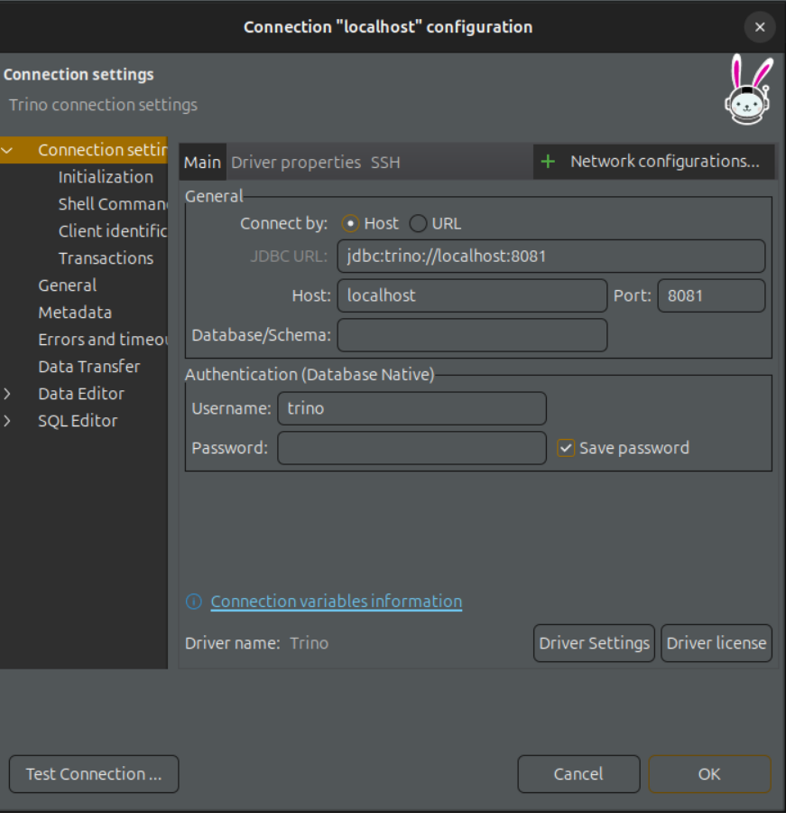
    
    * Additional SQL scripts can be found at **scripts/** 

12. **Feature Store with Feast:**
    * In folder `feature_store`, there are 2 items: 
        * Folder `data` which contains online_store.db and registry.db
        * File config `feature_store.yaml` to create a Feature Store
    * Register the feature views defined with `3_1_fs_register_table.py`. This step is already included in the `gen_lxw_features.py`.
    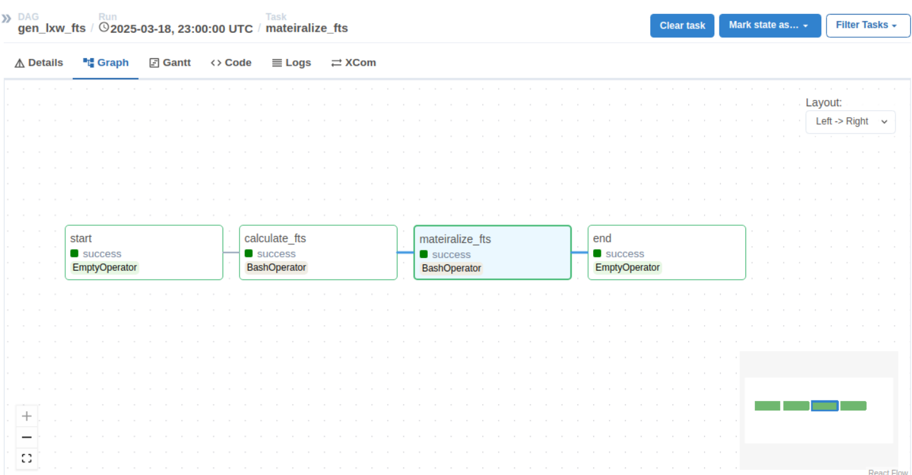

    * Retrieve features using Feast `3_2_fs_get_features.py`. User can modify this script to get the ouput in PySpark DataFrame or Pandas DataFrame.
    * Feature tables `transaction-data`:
    ```python
    schema=[
       Field(name="num_transactions_l1w", dtype=Int64),
       Field(name="total_amount_l1w", dtype=Float32),
       Field(name="avg_amount_l1w", dtype=Float32),
       Field(name="min_amount_l1w", dtype=Float32),
       Field(name="max_amount_l1w", dtype=Float32),
       Field(name="num_vendors_l1w", dtype=Int64),
       Field(name="num_sources_l1w", dtype=Int64)
    ]
    ```
    * Get online features from sqlite DB
    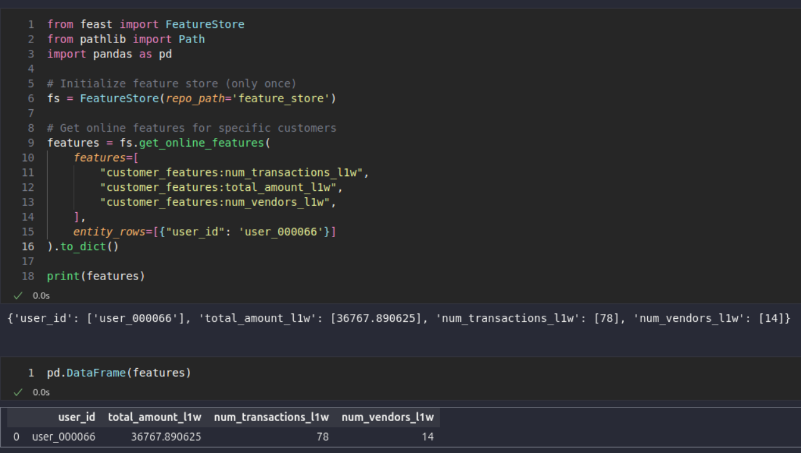

## Conclusion

### Outputs

*   Customer Table: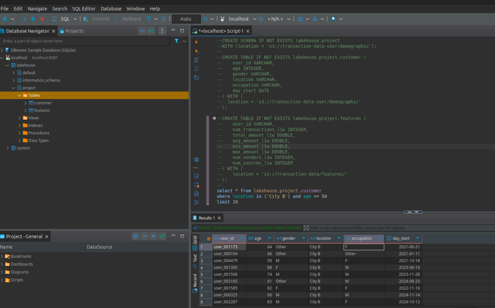
*   Transaction Table: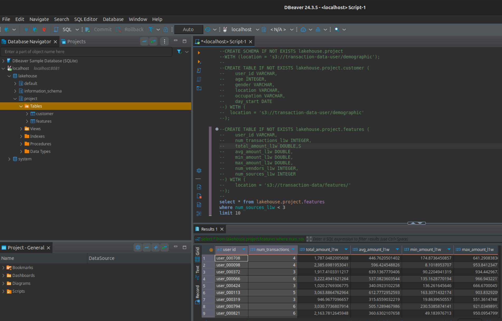

### Future Expansion

*   **Real-time Stream Processing:** Implement Spark Structured Streaming or Flink jobs to process Kafka events in near real-time.
*   **Monitoring & Alerting:** Integrate Prometheus and Grafana for monitoring system metrics and Kafka lags. Add alerting mechanisms.
*   **Data Quality Checks:** Integrate tools like Great Expectations for data validation within the Airflow DAGs.
*   **Model Training/Serving:** Add steps for training ML models using the features from MinIO or Feast and deploy models using tools like MLflow or Seldon Core.
*   **Enhanced Security:** Implement more robust secrets management (e.g., HashiCorp Vault) instead of `.env` files for production environments.
*   **Cloud Deployment:** Adapt the Docker Compose setup for deployment on cloud platforms like AWS EKS, GCP GKE, or Azure AKS using Helm charts or similar tools.