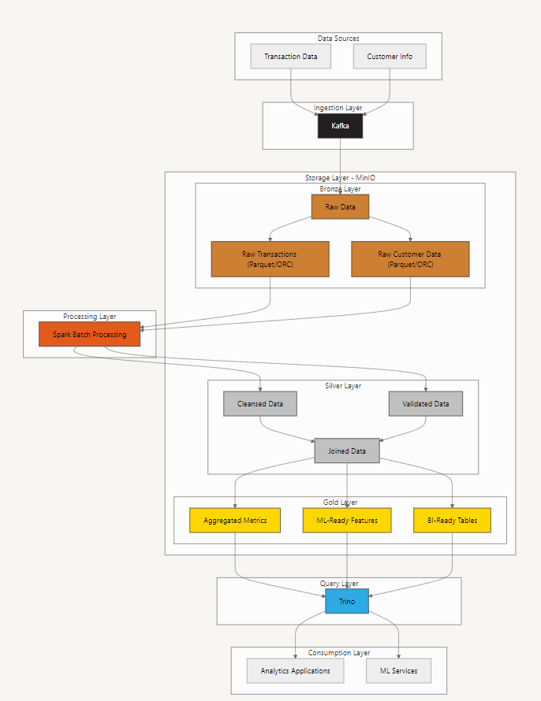

# MLOPs Final Project: Data Processing Pipeline

## Table of Contents

1.  [Problem Statement](#problem-statement)
2.  [Approach & Concept](#approach--concept)
3.  [Technology Stack](#technology-stack)
4.  [Quickstart](#quickstart)
    *   [Docker Setup](#docker-setup)
    *   [Source Code](#source-code)
    *   [Instructions](#instructions)
5.  [Conclusion](#conclusion)
    *   [Images](#images)
    *   [Summary](#summary)
    *   [Future Expansion](#future-expansion)

## Problem Statement

The objective is to build an efficient, scalable, and flexible data processing pipeline that supports batch and streaming data ingestion while ensuring high-quality data output.

## Approach & Concept

The data processing flow consists of multiple layers:

*   **Ingestion Layer:** Captures data from sources such as transactions and customer information.
*   **Storage Layer (MinIO - Bronze Layer):** Stores raw data in Parquet/ORC format.
*   **Processing Layer (Spark Batch Processing):** Processes raw data into cleansed and validated formats.
*   **Silver Layer:** Combines and joins data for further transformations.
*   **Gold Layer:** Stores aggregated metrics, ML-ready features, and BI-ready tables.
*   **Query Layer (Trino):** Allows querying the processed data.
*   **Consumption Layer:** Supports analytics applications and ML services.



## Technology Stack

1.  **Data Source**
    *   Self Generated Data:
     ```shell
        schema = StructType([
                StructField("User ID", StringType(), True),
                StructField("Transaction ID", StringType(), True),
                StructField("Amount", DoubleType(), True),
                StructField("Vendor", StringType(), True),
                StructField("Sources", StringType(), True),
                StructField("Time", StringType(), True)
                ])
    ```
    * Transaction Data is generated daily
    * Customer Data is generated one time and ingest to MinIO
2.  **Ingestion**
    *   Kafka
3.  **Storage**
    *   MinIO on Kubernetes (Simulated Locally with Docker)
4.  **Batch Processing**
    *   Spark DataFrame
    *   Pandas
5.  **Orchestration**
    *   Airflow
6.  **Serving (Optional)**
    *   BI Tool for Dashboarding (Using Trino)
    *   Using MinIO as Feature Store

## Quickstart

### Docker Setup

The project uses Docker and Docker Compose for easy deployment. Key files:

*   **`docker-compose.yaml`**: Defines the services (Airflow, Kafka, MinIO, Trino, etc.) and their configurations. Located at `docker_all/docker-airflow.yaml`

*   **`config.Dockerfile`**: Defines the build steps for the Airflow images, including installing dependencies. Located at `docker_all/config.Dockerfile`

### Source Code

The source code is organized into several directories:

*   **`dags/`**: Contains Airflow DAGs for orchestrating the data pipeline.
    *   `gen_data_daily.py`: DAG for generating daily transaction data and ingesting it into Kafka. Located at `docker_all/dags/gen_data_daily.py`
    *   `gen_lxw_fts.py`: DAG for calculating weekly features using Spark. Located at `docker_all/dags/gen_lxw_fts.py`
*   **`external_scripts/`**: Contains Python scripts executed by Airflow tasks.
    *   `1_gen_transaction_data.py`: Generates pseudo-transaction data and sends it to Kafka. Located at `scripts/1_gen_transaction_data.py`
    *   `2_calculate_features.py`: Calculates features from transaction data using Spark. Located at `scripts/2_calculate_features.py`
*   **`scripts/`**: Contains utility scripts.
    *   `0_gen_user_table.py`: Generates user data and stores it in MinIO. Located at `scripts/0_gen_user_table.py`
    *   `.env`: Contains environment variables for the scripts. Located at `/scripts/.env`
*   **`trino/`**: Contains configuration files for Trino.
    *   `catalog/lakehouse.properties`: Defines the connection to the Hive Metastore and MinIO for querying Delta Lake tables. Located at `docker_all/trino/catalog/lakehouse.properties`

### Instructions

1.  **Clone the repository:**

    ```shell
    git clone <repository_url>
    cd <repository_directory>
    ```

2.  **Create a folder to get yaml file for airflow:**

    ```shell
    mkdir ~/docker_all
    cd ~/docker_all

    curl -LfO 'https://airflow.apache.org/docs/apache-airflow/2.8.0/docker-compose.yaml'
    ```

3.  **Create folders for airflow setup:**

    ```shell
    mkdir -p ./dags ./logs ./plugins ./scripts ./external_scripts ./results

    sudo chmod -R 777 ./dags ./logs ./plugins ./scripts ./external_scripts ./results
    ```

4.  **Build image with a custom Dockerfile:**

    *   Dockerfile: `docker_all/config.Dockerfile`
        *   Need to specify `airflow-base` and `airflow-worker` (build stages)
        *   `airflow-base`: This stage installs common dependencies like Java, build tools, and Python. It serves as a base for other stages.
        *   `airflow-worker`: This stage is based on `airflow-base` and installs worker-specific Python packages like `pyspark`, `pydeequ`, and other data-related libraries. => This stage is for Airflow worker nodes that execute tasks using these dependencies

5.  **Edit config YAML:**

    *   YAML: `docker_all/docker-airflow.yaml`
        *   `/your/external/scripts:/opt/airflow/external_scripts`  # Add this line to help airflow can access external scripts
        *   `/your/external/output:/opt/airflow/results`  # Add this line # Add this line to help airflow can access external folder
        *   Add build with context and target for airflow services => To reduce the time to build images. Only airflow-worker has pysaprk and other Python libraries
        *   Add mems to reduce resource consumption
        *   Add volumes for some services

6.  **Set the `AIRFLOW_UID`:**

    *   Ensure the `AIRFLOW_UID` environment variable is set correctly to avoid permission issues. This is often set in the `.env` file or directly in the `docker-compose.yaml`.  The current value is located at `docker_all/AIRFLOW_UID`
    * Setup the password:
    ```bash
    docker compose exec airflow-webserver airflow users create \
    --username admin \
    --firstname Admin \
    --lastname User \
    --role Admin \
    --email admin@example.com \
    --password admin
    ```

7.  **Start the services:**

    ```shell
    docker-compose up -d
    ```

8.  **Access Airflow:**

    *   Open your web browser and navigate to `http://localhost:9091`.
    

9.  **Access MinIO:**

    *   Open your web browser and navigate to `http://localhost:9010`.
    *   Use the credentials defined in the `.env` file (`S3_ACCESS_KEY` and `S3_SECRET_KEY`).
    

10. **Access Trino:**

    *   Open your web browser and navigate to `http://localhost:8081`.
    * Using Trino to connect to MinIO
    * Create Schema to query:

    ```sql
    # SCHEMA
    CREATE SCHEMA IF NOT EXISTS lakehouse.project
    WITH (location = 's3://transaction-data-user/demographic');

    # Customer Data
    CREATE TABLE IF NOT EXISTS lakehouse.project.customer (
        user_id VARCHAR,
        age INTEGER,
        gender VARCHAR,
        location VARCHAR,
        occupation VARCHAR,
        day_start DATE
    ) WITH (
    location = 's3://transaction-data-user/demographic'
    );

    # Features
    CREATE TABLE IF NOT EXISTS lakehouse.project.features (
        user_id VARCHAR,
        num_transactions_l1w INTEGER,
        total_amount_l1w DOUBLE,S
        avg_amount_l1w DOUBLE,
        min_amount_l1w DOUBLE,
        max_amount_l1w DOUBLE,
        num_vendors_l1w INTEGER,
        num_sources_l1w INTEGER
    ) WITH (
        location = 's3://transaction-data/features/'
    );
    ```
    

11. **Access Kafka UI:**

    *   Open your web browser and navigate to `http://localhost:8080`.
    
    
## Conclusion

### Outputs

*   Customer Table:
*   Transaction Table:

### Summary

The project efficiently processes and ingests data into MinIO, ensuring high availability and usability for reporting and analytics.

### Future Expansion

*   Implement CDC with Debezium for real-time data ingestion.
*   Integrate Flink or Spark Streaming for real-time data processing.
*   Add data quality checks using Deequ or Grafana
*   Deploy the pipeline on a Kubernetes cluster for better scalability and resilience.
*   Implement a feature store for managing and serving ML features.
*   Integrate a BI tool for creating dashboards and visualizations.