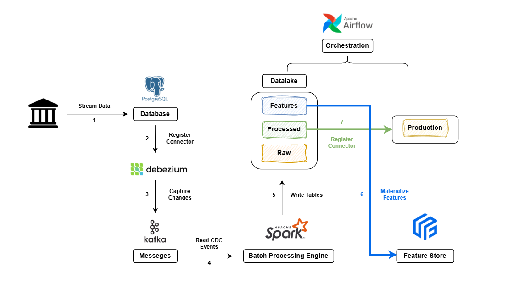
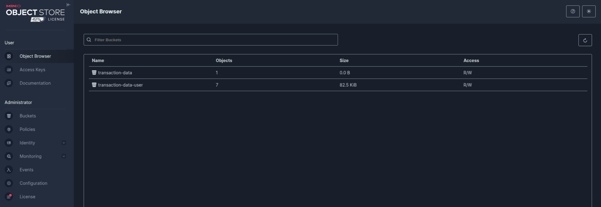
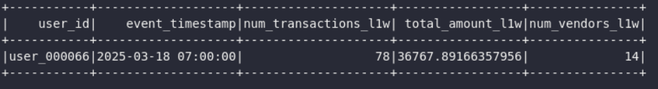

# MLOPs Final Project: Data Processing Pipeline

## Table of Contents

1.  [Problem Statement](#problem-statement)
2.  [Approach & Concept](#approach--concept)
3.  [Technology Stack](#technology-stack)
4.  [Quickstart](#quickstart)
    *   [Docker Setup](#docker-setup)
    *   [Source Code](#source-code)
    *   [Instructions](#instructions)
5.  [Conclusion](#conclusion)
    *   [Images](#images)
    *   [Summary](#summary)
    *   [Future Expansion](#future-expansion)

## Problem Statement

The objective of this project is to build a data processing pipeline that supports both batch and streaming data ingestion. The data used in this project is a simplified version of transaction data commonly used in banking



## Approach & Concept

The data processing flow consists of multiple layers:

*   **Source Layer:** PostgreSQL database storing transaction data
*   **CDC Layer (Debezium):** Captures data changes from PostgreSQL and publishes to Kafka topics
*   **Ingestion Layer:** 
    * Batch: Direct data generation to PostgreSQL
    * Streaming: Change data capture via Debezium-Kafka pipeline
*   **Processing Layer:**
    * Batch Processing: Spark jobs for feature engineering
    * Stream Processing: Real-time CDC event processing
*   **Storage Layer (MinIO):** 
    * Captures processed CDC events from Kafka
*   **Query Layer (Trino):** Allows querying the processed data across all layers
*   **Consumption Layer:** Supports analytics applications and ML services


## Technology Stack

1.  **Data Source**
    *   Self Generated Data:
     ```shell
        schema = StructType([
                StructField("User ID", StringType(), True),
                StructField("Transaction ID", StringType(), True),
                StructField("Amount", DoubleType(), True),
                StructField("Vendor", StringType(), True),
                StructField("Sources", StringType(), True),
                StructField("Time", StringType(), True)
                ])
    ```
    * Transaction Data: Generated daily via `1_gen_transaction_data.py` and stored in PostgreSQL
    * Customer Data: Generated once via `0_gen_user_table.py` and stored in MinIO as Parquet format
2.  **CDC**
    * Debezium
3.  **Ingestion**
    *   Kafka
4.  **Storage**
    *   MinIO on Kubernetes (Simulated Locally with Docker)
5.  **Batch Processing**
    *   Spark DataFrame
    *   Pandas
6.  **Orchestration**
    *   Airflow
7.  **Serving (Optional)**
    *   BI Tool for Dashboarding (Using Trino)
    *   Feature Store with Feast

## Quickstart

### Docker Setup

The project uses Docker and Docker Compose for easy deployment. Key files:

*   **`docker-compose.yaml`**: Defines the services (Airflow, Kafka, MinIO, Trino, etc.) and their configurations. Located at `docker_all/docker-airflow.yaml`

*   **`Dockerfile`**: Defines the build steps for the Airflow images, including installing dependencies. Located at `docker_all/Dockerfile`

### Source Code

The source code is organized into several directories:

*   **`dags/`**: Contains Airflow DAGs for orchestrating the data pipeline.
    *   `gen_data_daily.py`: DAG for generating daily transaction data and ingesting it into Kafka. Located at `docker_all/dags/gen_data_daily.py`
    *   `gen_lxw_fts.py`: DAG for calculating weekly features using Spark. Located at `docker_all/dags/gen_lxw_fts.py`
*   **`external_scripts/`**: Contains Python scripts executed by Airflow tasks.
    *   `0_gen_user_table.py`: Generates customer demographic data and stores in MinIO as Parquet format
    *   `0_register_debezium.py`: Registers Debezium connector to capture PostgreSQL changes
    *   `1_gen_transaction_data.py`: Generates daily transaction data and stores in PostgreSQL
    *   `2_calculate_features.py`: Reads CDC events from Kafka, calculates user features using Spark, and stores results in MinIO
*   **`scripts/`**: Contains utility scripts.
    *   `0_gen_user_table.py`: Generates user data and stores it in MinIO. Located at `scripts/0_gen_user_table.py`
    *   `.env`: Contains environment variables for the scripts. Located at `/scripts/.env`
*   **`trino/`**: Contains configuration files for Trino.
    *   `catalog/lakehouse.properties`: Defines the connection to the Hive Metastore and MinIO for querying Delta Lake tables. Located at `docker_all/trino/catalog/lakehouse.properties`

### Instructions
0.  **Prerequisites:**
    *   Docker and Docker Compose installed.
    *   Git (for cloning the repository).
    *   `Requirements.txt` for testing in a local machine

1.  **Clone the repository:**

    ```shell
    git clone <repository_url>
    cd <repository_directory>
    ```

2.  **Create a folder to get yaml file for airflow:**

    ```shell
    curl -LfO 'https://airflow.apache.org/docs/apache-airflow/2.8.0/docker-compose.yaml'
    ```

3.  **Create folders for airflow setup:**

    ```shell
    mkdir -p ./dags ./logs ./plugins ./scripts ./external_scripts ./results

    sudo chmod -R 775 ./dags ./logs ./plugins ./scripts ./external_scripts ./results
    ```

4.  **Build image with a custom Dockerfile:**

    *   Dockerfile: `docker_all/config.Dockerfile`
        *   Need to specify `airflow-base` and `airflow-worker` (build stages)
        *   `airflow-base`: This stage installs common dependencies like Java, build tools, and Python. It serves as a base for other stages.
        *   `airflow-worker`: This stage is based on `airflow-base` and installs worker-specific Python packages like `pyspark`, `pydeequ`, and other data-related libraries. => This stage is for Airflow worker nodes that execute tasks using these dependencies

5.  **Edit config YAML:**

    *   YAML: `docker_all/docker-airflow.yaml`
        *   `/your/external/scripts:/opt/airflow/external_scripts`  # Add this line to help airflow can access external scripts
        *   `/your/external/output:/opt/airflow/results`  # Add this line # Add this line to help airflow can access external folder
        *   Add build with context and target for airflow services => To reduce the time to build images. Only airflow-worker has pysaprk and other Python libraries
        *   Add mems to reduce resource consumption
        *   Add volumes for some services

6.  **Set the `AIRFLOW_UID`:**

    *   Ensure the `AIRFLOW_UID` environment variable is set correctly to avoid permission issues. This is often set in the `.env` file or directly in the `docker-compose.yaml`.  The current value is located at `docker_all/AIRFLOW_UID`
    * Setup the password:
    ```bash
    docker compose exec airflow-webserver airflow users create \
    --username admin \
    --firstname Admin \
    --lastname User \
    --role Admin \
    --email admin@example.com \
    --password admin
    ```

7.  **Start the services:**

    ```shell
    docker-compose up -d
    ```

8.  **Access Airflow:**

    *   Open your web browser and navigate to `http://localhost:9091`.
    

9. **Access Kafka UI:**

    *   Open your web browser and navigate to `http://localhost:8080`.
    
    

10. **Access PostgreSQL:**
    

11. **Registers Debezium Connector**
    * Setup debezium config in `config/config_debezium.json`.
    * Run script `0_register_debezium.py` to register Debezium connector to capture changes in the data source and stores them in Kafka topics.
    * After running this script:
    

    

12. **Generates user table (optional)**
    * Run script `0_gen_user_table.py` to genetate user info and stores in MinIO bucket (`transaction-data-user`).
    

13. **Using Airflow to setup workflow**  
    * The pipeline consists of two main steps:
        1. Transaction data generation and ingestion
        2. Feature calculation and aggregation
    * There are 2 seperate dags: daily data and agg data (7 days):
        *  `gen_data_daily.py`
        *  `gen_lxw_fts.py`
    * Create pool `transaction_data` in Airflow UI (optional)

14. **Access MinIO:**
    * Open your web browser and navigate to `http://localhost:9010`.
    *   Use the credentials defined in the `.env` file (`S3_ACCESS_KEY` and `S3_SECRET_KEY`).
    

15. **Access Trino:**

    *   Open your web browser and navigate to `http://localhost:8081`.
    * Using Trino to connect to MinIO
    * Create Schema to query:

    ```sql
    # SCHEMA
    CREATE SCHEMA IF NOT EXISTS lakehouse.project
    WITH (location = 's3://transaction-data-user/demographic');

    # Customer Data
    CREATE TABLE IF NOT EXISTS lakehouse.project.customer (
        user_id VARCHAR,
        age INTEGER,
        gender VARCHAR,
        location VARCHAR,
        occupation VARCHAR,
        day_start DATE
    ) WITH (
    location = 's3://transaction-data-user/demographic'
    );

    # Features
    CREATE TABLE IF NOT EXISTS lakehouse.project.features (
        user_id VARCHAR,
        num_transactions_l1w INTEGER,
        total_amount_l1w DOUBLE,S
        avg_amount_l1w DOUBLE,
        min_amount_l1w DOUBLE,
        max_amount_l1w DOUBLE,
        num_vendors_l1w INTEGER,
        num_sources_l1w INTEGER
    ) WITH (
        location = 's3://transaction-data/features/'
    );
    ```
    
    
    * Additional SQL scripts can be found at **scripts/** 

16. **Feature Store with Feast:**
    * In folder `feature_store`, there are 2 items: 
        * Folder `data` which contains online_store.db and registry.db
        * File config `feature_store.yaml` to create a Feature Store
    * Register the feature views defined with `3_1_fs_register_table.py`
    * Retrieve features using Feast `3_2_fs_get_features.py`. User can modify this script to get the ouput in PySpark DataFrame or Pandas DataFrame.

    

    

## Conclusion

### Outputs

*   Customer Table:
*   Transaction Table:

### Future Expansion

*   **Real-time Stream Processing:** Implement Spark Structured Streaming or Flink jobs to process Kafka events in near real-time.
*   **Monitoring & Alerting:** Integrate Prometheus and Grafana for monitoring system metrics and Kafka lags. Add alerting mechanisms.
*   **Data Quality Checks:** Integrate tools like Great Expectations for data validation within the Airflow DAGs.
*   **Model Training/Serving:** Add steps for training ML models using the features from MinIO or Feast and deploy models using tools like MLflow or Seldon Core.
*   **Enhanced Security:** Implement more robust secrets management (e.g., HashiCorp Vault) instead of `.env` files for production environments.
*   **Cloud Deployment:** Adapt the Docker Compose setup for deployment on cloud platforms like AWS EKS, GCP GKE, or Azure AKS using Helm charts or similar tools.